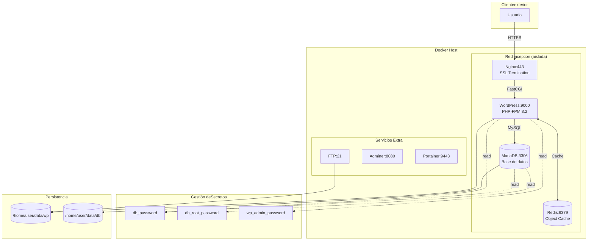

# Inception


## Descripción

**Inception** es una infraestructura cloud-native que despliega WordPress en arquitectura de microservicios containerizados. Implementa un stack LEMP completo (Linux, Nginx, MariaDB, PHP-FPM) con caché Redis para alto rendimiento, secrets management con Docker Secrets y orquestación mediante Docker Compose. Demuestra competencias avanzadas enDevOps, containerización y diseño de arquitecturas escalables y seguras.

## Características Principales

- **TLS/SSL Seguro**: Terminación HTTPS con certificados auto-firmados, soporte TLS 1.2 y 1.3
- **Object Cache con Redis**: Integración automática de Redis Cache para WordPress, reduciendo latencia de BD
- **Docker Secrets**: Gestión segura de credenciales sin hardcodeo en imágenes
- **Bootstrap Automatizado**: WP-CLI para instalación y configuración automática de WordPress
- **Red Aislada**: Network dedicada `inception` para comunicación inter-servicios
- **Persistencia Garantizada**: Volúmenes bind-mount con idempotencia en reinicios
- **Alta Disponibilidad**: Política `unless-stopped` en todos los contenedores
- **Servicios de Administración**: Adminer (BD), Portainer (Docker), FTP (archivos)

## Stack Tecnológico

| Categoría | Tecnología | Versión | Función |
|-----------|-----------|---------|---------|
| **Reverse Proxy** | Nginx | 1.22+ | SSL termination, FastCGI proxy |
| **Application Server** | PHP-FPM | 8.2 | Procesamiento PHP |
| **CMS** | WordPress | Latest | Gestión de contenido |
| **Database** | MariaDB | 10.11 | Almacenamiento relacional |
| **Cache** | Redis | 7.x | Object cache, sesiones |
| **Orchestration** | Docker Compose | 2.x | Multi-container management |
| **Base OS** | Debian | Bookworm (12) | Imágenes base lightweight |
| **CLI Tools** | WP-CLI | Latest | Automatización WordPress |

### Servicios Adicionales

| Servicio | Puerto | Propósito |
|----------|--------|-----------|
|vsftpd | 21, 21000-21010 | Acceso FTP seguro |
| Adminer | 8081 | Administración web de BD |
| Portainer CE | 9443 | Dashboard de gestión Docker |

## Decisiones Técnicas y Arquitectura

### Separación de Responsabilidades
La arquitectura implementa el patrón **separation of concerns** donde cada contenedor tiene responsabilidad única. Nginx actúa exclusivamente como reverse proxy terminando SSL/TLS, delegando el procesamiento PHP a PHP-FPM mediante FastCGI. Esto permite escalar horizontalmente PHP Workers de forma independiente al servidor web.

### Secret Management
Las credenciales seinyectan mediante **Docker Secrets** (archivos montados en `/run/secrets/`) evitando hardcodeo en Dockerfiles o variables de entorno expuestas. Los scripts de entrypoint leen los secrets en runtime, manteniendo las imágenes portables y seguras.

### Bootstrap Idempotente
Los scripts `entrypoint.sh` implementan **inicialización idempotente**: detectan estado previo (archivos marker, wp-config.php existente) y ejecutan configuración solo cuando es necesario. MariaDB inicializa esquemas con `mariadb-install-db` y SQL de bootstrap; WordPress detecta instalación previa antes de `wp core install`.

### Conexiones con Wait-For-Dependency
WordPress utiliza `mysqladmin ping` en bucle para garantizar que MariaDB responde antes de conectar. Este patrón de **healthcheck inicial**previene race conditions en el arranque de contenedores dependientes.

### BindMounts vs Volúmenes Nombrados
- `/home/user/data/wp`: WordPress files (bind mount) - permite acceso FTP directo
- `/home/user/data/db`: MariaDB data (bind mount) - persistencia de datos
- Volúmenes Docker: Redis y Portainer (datos internos no expuestos)

## Diagrama de Arquitectura



## Instalación

### Prerrequisitos
- Docker Engine 24.x+
- Docker Compose 2.x+
- Make (opcional)

### Pasos de Instalación

```bash
# 1. Clonar repositorio
git clone https://github.com/samuelhm/inception.git
cd inception

# 2. Crear directorio de secretos
mkdir -p secrets

# 3. Generar contraseñas seguras (ejemplo)
openssl rand -base64 32 > secrets/db_password.txt
openssl rand -base64 32 > secrets/db_root_password.txt
openssl rand -base64 32 > secrets/wp_admin_password.txt
openssl rand -base64 32 > secrets/wp_second_password.txt
openssl rand -base64 32 > secrets/mysql_supervisor_password.txt

# 4. Crear archivo de entorno
cat > srcs/.env << 'EOF'
DOMAIN=localhost
WP_URL=https://localhost
WP_TITLE="Mi Blog"
WP_ADMIN_USER=admin
WP_ADMIN_EMAIL=admin@localhost
WP_SECOND_USER=editor
WP_SECOND_EMAIL=editor@localhost
MYSQL_DATABASE=wordpress
MYSQL_USER=wp_user
MYSQL_SUPERVISOR=wp_supervisor
FTP_USER=ftpuser
FTP_PASS=ftppassword
EOF

# 5. Crear directorios de datos
mkdir -p /home/$USER/data/wp /home/$USER/data/db

# 6. Construir y desplegar
make up
```

### Comandos Disponibles

```bash
make up       # Construir y levantar servicios
make down     # Detener servicios
make clean    # Detener y eliminar volúmenes
make fclean   # Limpieza total (incluye datos)
make re       # Reconstrucción desde cero
```

### Verificación

```bash
# Estado de contenedores
docker compose -f srcs/docker-compose.yml ps

# Logs de un servicio
docker logs nginx
docker logs wordpress
docker logs mariadb
```

### Acceso a Servicios

| Servicio | URL | Descripción |
|----------|-----|-------------|
| WordPress | https://localhost | Sitio principal |
| Adminer | http://localhost:8081 | Gestión de BD |
| Portainer | https://localhost:9443 | Dashboard Docker |
| FTP | localhost:21 | Acceso archivos |

## Estructura del Proyecto

```
inception/
├── Makefile
├── srcs/
│   ├── docker-compose.yml
│   └── requirements/
│       ├── nginx/
│       │   ├── Dockerfile
│       │   ├── conf/nginx.conf
│       │   └── tools/entrypoint.sh
│       ├── wordpress/
│       │   ├── Dockerfile
│       │   ├── conf/www.conf
│       │   └── tools/entrypoint.sh
│       ├── mariadb/
│       │   ├── Dockerfile
│       │   ├── conf/my.cnf
│       │   └── tools/
│       │       ├── entrypoint.sh
│       │       └── init_db.sh
│       └── bonus/
│           ├── redis/
│           ├── ftp/
│           ├── adminer/
│           └── portainer/
└── secrets/
```

## Contacto

| Plataforma | Enlace |
|------------|--------|
| GitHub | https://github.com/samuelhm/ |
| LinkedIn | https://www.linkedin.com/in/shurtado-m/ |

---

<p align="center">Proyecto del currículum de42 School</p>