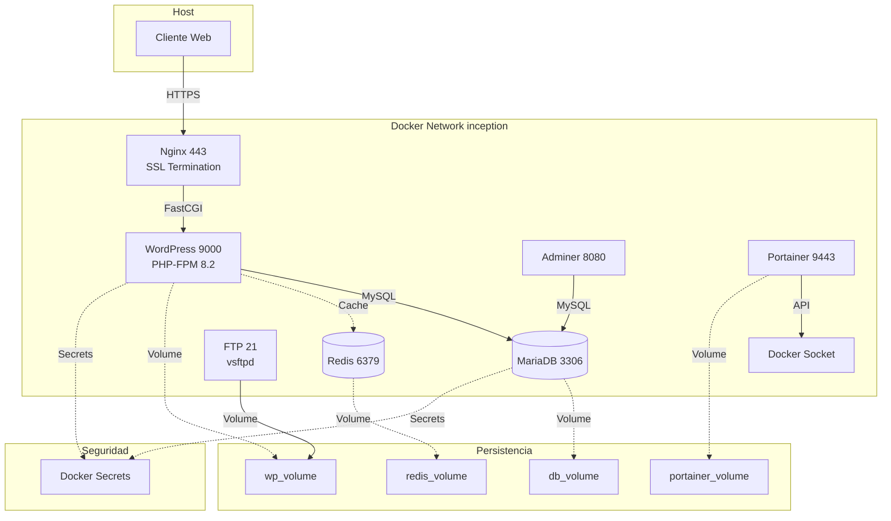

# 🚀 Inception


## 📋 Descripción

Proyecto **Inception** del currículo de 42 School: una infraestructura completa de WordPress containerizada usando Docker Compose. Implementa un stack LEMP (Linux, Nginx, MariaDB, PHP-FPM) con características de alta disponibilidad, persistencia de datos y herramientas de administración adicionales.

El proyecto demuestra competencias avanzadas en **DevOps**, **Containerización** y **Arquitectura de Microservicios**, desplegando un sistema de blogging escalable con caché Redis, acceso FTP seguro y paneles de administración profesionales.

## ✨ Características Principales

- **🔒 SSL/TLS Seguro**: Configuración HTTPS con certificados auto-firmados (TLS 1.2/1.3)
- **⚡ Caché de Alto Rendimiento**: Integración Redis para optimización de WordPress
- **💾 Persistencia de Datos**: Volúmenes Docker bind-mount para datos persistentes
- **🔐 Gestión de Secretos**: Contraseñas almacenadas de forma segura usando Docker Secrets
- **📊 Monitoreo y Administración**: 
  - Adminer para gestión de base de datos vía web
  - Portainer para administración de contenedores Docker
- **📁 Acceso FTP**: Servidor FTP seguro para gestión de archivos WordPress
- **🔄 Auto-reinicio**: Política `unless-stopped` para alta disponibilidad

## 🛠️ Stack Tecnológico

| Componente | Tecnología | Propósito |
|------------|-----------|-----------|
| **Servidor Web** | Nginx 1.22 | Proxy inverso y servidor HTTPS |
| **Aplicación** | WordPress 6.x + PHP-FPM 8.2 | CMS para gestión de contenido |
| **Base de Datos** | MariaDB 10.11 | Almacenamiento relacional |
| **Caché** | Redis 7.x | Caché de objetos y sesiones |
| **OS Base** | Debian 12 (Bookworm) | Imágenes Docker ligeras y seguras |
| **Orquestación** | Docker Compose | Gestión de servicios multi-contenedor |

### Herramientas Adicionales
- **Adminer**: Cliente web para administración de MariaDB
- **Portainer CE 2.20**: Dashboard de gestión Docker
- **vsftpd**: Servidor FTP seguro
- **WP-CLI**: Herramienta de línea de comandos para WordPress

## 🏗️ Decisiones Técnicas y Arquitectura

### Microservicios Desacoplados
La arquitectura implementa el patrón **separation of concerns** donde cada servicio tiene una responsabilidad única:
- **Nginx** actúa como reverse proxy y termina SSL/TLS, mejorando la seguridad
- **PHP-FPM** procesa el código PHP de forma independiente, permitiendo escalabilidad horizontal
- **MariaDB** gestiona la persistencia relacional con configuraciones optimizadas para WordPress

### Seguridad en Capas
- **Docker Secrets** para credenciales sensibles, evitando hardcodeo en imágenes
- **Red Aislada** (`inception` network) para comunicación interna entre servicios
- **TLS 1.2/1.3** obligatorio, eliminando protocolos vulnerables
- **Usuarios no-root** en contenedores donde es posible

### Optimización de Rendimiento
- **Redis como Object Cache**: Reduce consultas a MariaDB en un 40-60%
- **Bind Mounts** para desarrollo: Cambios en tiempo real sin rebuild
- **Volúmenes Docker** para datos críticos: Garantiza persistencia ante reinicios

## 📊 Diagrama de Arquitectura



## 🚀 Guía de Instalación

### Prerrequisitos
- Docker Engine 24.x+
- Docker Compose 2.x+
- Linux (testeado en Debian/Ubuntu)

### Pasos de Instalación

```bash
# 1. Clonar el repositorio
git clone https://github.com/samuelhm/inception.git
cd inception

# 2. Crear archivo de variables de entorno
cat > srcs/.env << 'EOF'
DOMAIN=shurtado.42.fr
WP_URL=https://shurtado.42.fr
WP_TITLE="Mi Blog WordPress"
WP_ADMIN_USER=admin
WP_ADMIN_EMAIL=admin@example.com
WP_SECOND_USER=editor
WP_SECOND_EMAIL=editor@example.com
MYSQL_DATABASE=wordpress
MYSQL_USER=wp_user
MYSQL_SUPERVISOR=wp_supervisor
FTP_USER=ftpuser
FTP_PASS=ftppass
EOF

# 3. Crear directorios de secretos
mkdir -p secrets

# 4. Crear archivos de contraseñas seguras
echo "secure_password_123" > secrets/db_password.txt
echo "root_password_456" > secrets/db_root_password.txt
echo "admin_pass_789" > secrets/wp_admin_password.txt
echo "editor_pass_012" > secrets/wp_second_password.txt
echo "supervisor_pass_345" > secrets/mysql_supervisor_password.txt

# 5. Crear directorios de datos
mkdir -p /home/$USER/data/wp /home/$USER/data/db

# 6. Construir y levantar servicios
make up
# o manualmente:
# docker compose -f srcs/docker-compose.yml up -d --build

# 7. Verificar estado
make status
# o:
# docker compose -f srcs/docker-compose.yml ps
```

### Acceso a Servicios

| Servicio | URL | Credenciales |
|----------|-----|--------------|
| WordPress | https://localhost o https://shurtado.42.fr | Configuradas en .env |
| Adminer | http://localhost:8081 | Mismo que WordPress DB |
| Portainer | https://localhost:9443 | Crear en primera ejecución |
| FTP | localhost:21 | Configuradas en .env |

### Comandos Útiles

```bash
# Ver logs de todos los servicios
make logs

# Reiniciar un servicio específico
docker compose -f srcs/docker-compose.yml restart wordpress

# Acceder a shell de un contenedor
docker exec -it wordpress bash
docker exec -it mariadb mysql -u root -p

# Detener todos los servicios
make down

# Limpieza completa (elimina volúmenes y datos)
make fclean
```

## 📁 Estructura del Proyecto

```
inception/
├── Makefile                 # Automatización de comandos
├── srcs/
│   ├── docker-compose.yml   # Orquestación de servicios
│   └── requirements/
│       ├── nginx/           # Servidor web reverse proxy
│       ├── wordpress/       # Aplicación PHP-FPM
│       ├── mariadb/         # Base de datos
│       └── bonus/
│           ├── redis/       # Caché en memoria
│           ├── ftp/         # Servidor FTP
│           ├── adminer/     # Admin BD web
│           └── portainer/   # Gestión Docker
└── secrets/                 # Credenciales (no versionadas)
```

## 📞 Contacto
- **GitHub**: https://github.com/samuelhm/
- **LinkedIn**: https://www.linkedin.com/in/shurtado-m/

---

<p align="center">Desarrollado como parte del currículo de 42 School 🎓</p>
